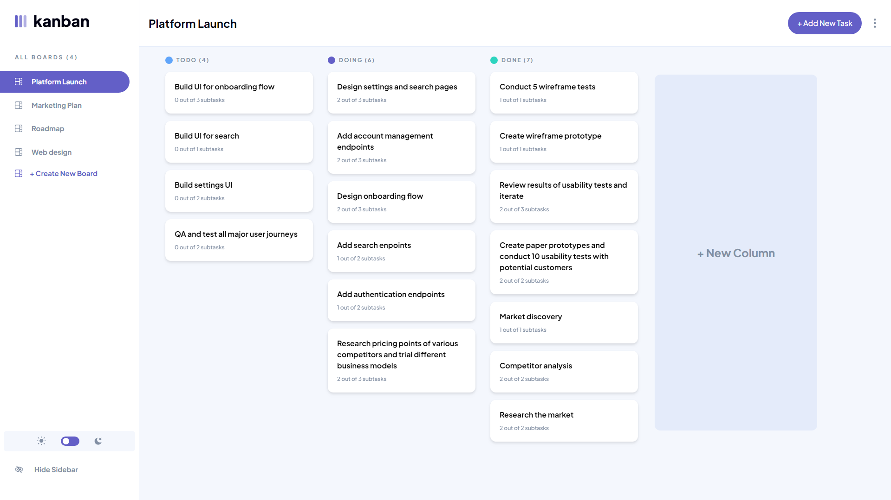

# Kanban task management web app

This is a solution to the [Kanban task management web app challenge on Frontend Mentor](https://www.frontendmentor.io/challenges/kanban-task-management-web-app-wgQLt-HlbB).

## Table of contents

- [Overview](#overview)
  - [The challenge](#the-challenge)
  - [Screenshot](#screenshot)
  - [Links](#links)
  - [Built with](#built-with)
- [Author](#author)

## Overview

### The challenge

Users should be able to:

- Create, read, update, and delete boards and tasks
- See hover states for all interactive elements on the page
- Receive form validations when trying to create/edit boards and tasks
- Mark subtasks as complete and move tasks between columns
- Hide/show the board sidebar
- Toggle the theme between light/dark modes
- Keep track of any changes, even after refreshing the browser
- This project is a full-stack application

### Screenshot

### Links

- Solution URL: [https://www.frontendmentor.io/solutions/kanban-task-management-web-app-Ny0OoFQH8f](https://www.frontendmentor.io/solutions/kanban-task-management-web-app-Ny0OoFQH8f)
- Live Site URL: [https://kanban-task-management-4jes1jbc9-jinyoung5497.vercel.app/](https://kanban-task-management-4jes1jbc9-jinyoung5497.vercel.app/)

### Built with

- MERN Stack
- React
- MongoDB
- Express js
- Tailwind CSS

## Author

- github - [Jinyoung Choi](https://github.com/jinyoung5497)
- Frontend Mentor - [@jinyoung5497](https://www.frontendmentor.io/profile/yourusername)
